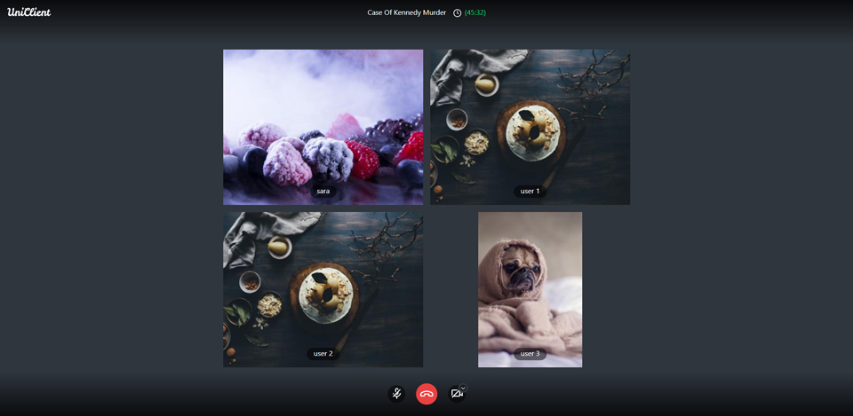

### Group Video Chat UI With Redux

real time web connection UI developed with no extra packages.

#### Screen Shot


### Let's Get start

```shell script
npm install & npm run start
```

#### features:

- add call
- show user stats
- drag and drop calls
- save redux state in local storage

#### help
press red button to add calls

#### todos:

- [x] grid solution
- [x] handle grid with redux
- [x] implement UI
